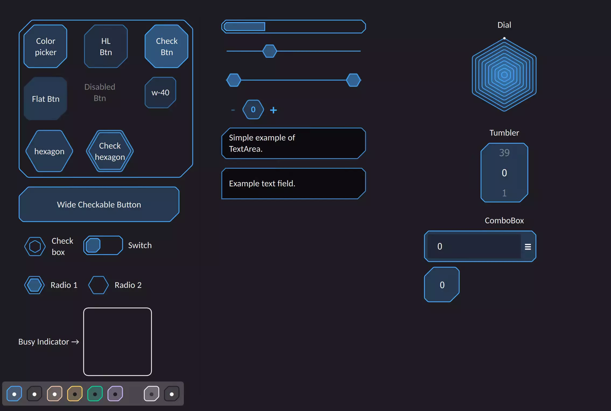

# QML Hive
<p>

<a href="https://www.blockchain.com/bch/address/bitcoincash:qrnwtxsk79kv6mt2hv8zdxy3phkqpkmcxgjzqktwa3">
</a></p>

**Hive** QtQuick2/QML theme, A hexagon-based style for essential QML controls.

*If you liked these components, please consider givin a star :star2:.*

## Preview
<div align="center">&nbsp;

</div>

## How to use
> **NOTE**: *There are some shaders used in this component that are currently incompatible with Qt6.*

### Usage

Clone the repository first.
```bash
git clone "https://github.com/SMR76/hive.git"
```
Then include `Hive.pri` in your project. <sub>[see example-1](example/example-1/example-1.pro#L11)</sub>
```make
include("path/to/Hive.pri")
```
Add `qrc:/` to the engine import path. <sub>[see example-1](example/example-1/main.cpp#L17)</sub>
```cpp
engine.addImportPath("qrc:/");
```
And finally import the `Hive` module. <sub>[see example-1](example/example-1/main.qml#L6)</sub>
```qml
import Hive 1.0
```

If you are confused, please refer to [example-1](example/example-1/) for a clearer understanding of what you should do.

## Components

- Button
- ProgressBar
- CheckBox
- Switch
- Radio Button
- Slider
- RangeSlider
- SpinBox
- Dial
- BusyIndicator
- Tumbler
- TextArea
- TextField
- ComboBox

## Issues

Please file an issue on [issues page](https://github.com/SMR76/hive/issues) if you have any problems.

## Documentation

[Documentation](docs/README.md) can be found in the `docs` directory.